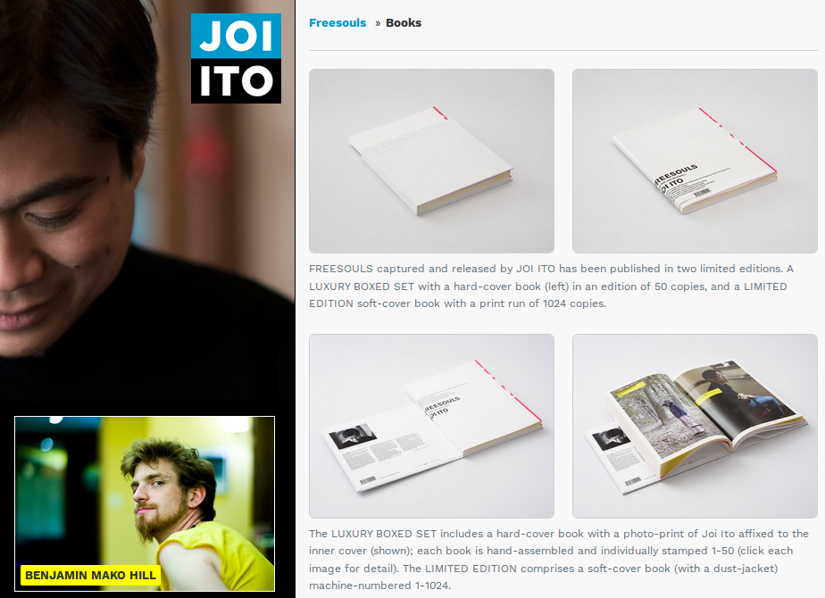

# FREESOULS.cc

296 Portraits by Joi Ito. Essays by Howard Rheingold, Lawrence Liang,
Cory Doctorow, Yochai Benkler, Isaac Mao and Marko Ahtisaari. With a
Foreword by Lawrence Lessig and a Special Interview with Joi Ito. 72
Crowd-sourced Definitions of What A Freesoul is. 36 Landscapes. 200
pages.
[FREESOULS.cc](http://freesouls.cc)

